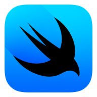

# Web GUI技术
目前的主流GUI平台大致如下：

各个平台都有自己的原生技术，但是原生技术往往难学难用，并且通用性受限，学习的性价比太低，开发的速度太慢，企业成本太高……
+ windows -> C#.NET (WinUI3、WPF)
+ MACOS、IOS、tvOS、watchOS -> Swift (SwiftUI)
+ linux -> C (GTK+)、C++（Qt）
+ Android、tv、watch -> Kotlin (Jetpack Compose)

| WinUI 3                 | SwiftUI                   | GTK +              | Compose         |
| ----------------------- | ------------------------- | ------------------ | --------------- |
|  |  |  |  |

对于特殊平台，如Web平台，使用Web开发技术；嵌入式平台，使用C++的Qt框架。抛开嵌入场景不谈，如果希望编写一次代码从而实现到处运行，在以前的一定时期内都是不可能的，而目前随着Web技术的功能和性能日益强大，且得益于Web技术本身与操作系统无关的特性，反而在社区中慢慢形成一种使用浏览器套壳的应用的风气，这种应用的性能天生就不好，需要臃肿的运行时环境和较慢的运行速度，我们不好评价这种做法，但是这确实是开发者的无奈妥协。
目前，Web应用是唯一能够在保持开发速度、一致性和差异性处理上满足横跨PC、移动端的GUI方案。其他的方案目前或多或少存在着问题。

## 跨平台框架
+ Qt。主要在嵌入式和高性能软件领域等高端领域，碍于C++本身的难度和开发效率问题，在很多时候，项目进行选型的时候，都是本着能不用C++就不用C++的宗旨的，另外，C++的开发基础设施稀烂，开发体验较差；
+ Electron。包揽了大部分的中低端领域PC端GUI开发市场，开发速度、界面美观、招人容易、跨平台一致性好、差异性也好；  

二者主要适用于PC端，对于移动端的支持不太行，移动端主要选手还是Flutter。

**未来可期**

+ Flutter。Flutter是目前最未来可期的技术，重写的底层引擎Impeller，旨在解决Flutter应用的“Early-onset jank”问题，同时为Flutter应用提供更高的定制性和性能。通过自绘制引擎，Flutter完成了全平台跨端的能力。但是，没有选择JavaScript而使用Dart语言是Flutter的痛点，Dart语言注定会阻止一部分先入为主的人。
+ tauri。tauri可以看做是为rust程序员使用的GUI框架，前端人基本可以不看。不过它本身的优势确实也是非常明显的，其包体积很小，利用操作系统的原生浏览器内核，同时使用rust做后端，也能在后端的方面提供非常强悍的性能，将耗时任务交给rust，可以在一定程度上解决Electron的js速度慢的问题。不过，tauri带来了新的问题，就是又把Electron抹平的Web兼容性问题带回来了。这样，书写tauri既要很高的Web前端水平，又要学习rust，那么这样的框架自身也是很劝退的。tauri对于移动端的适配是板上钉钉的，它可以带来Electron不想干的功能。随着rust在前端领域的渗透，如果rust能招致越来越多的前端人去学习，那么届时，tauri也将成为一个新的领军框架。

| Qt              | Electron                    | Flutter                   | Tauri                 |
| --------------- | --------------------------- | ------------------------- | --------------------- |
|  |  |  |  |

综上，目前的可供选择的GUI框架的情况大致如下

## Web框架
目前的Web框架主要是React和Vue，呈现出一大一中群小的局面，React占据了生态中的大部分，Vue其次，其他的框架占据的份额很小。

+ React。一大

+ Vue。一中。

+ Angular。使用面向对象、依赖注入、装饰器等技术进行开发，大而全。在React hooks横空出世后，人们逐渐发现了Web前端UI开发的灵活性的重要性，而面向对象的传统思路，加上js中`this`是个毒瘤，面向对象的编程风格逐步被函数编程风格所侵蚀，而Angular本事的自由度太低，灵活性差，开发速度慢，框架笨重，性能很差，份额持续减少，不再建议使用了。

+ Svelte。2016年首发，2019年稳定的新兴框架，提出了无虚拟dom的架构，不生成运行时，使用和vue相似的单文件编译方式，拥有强悍的性能，较小的内存占用和较小的打包体积。
+ Solid。2018年首发，2020年稳定的新兴框架，究极框架缝合怪，是一个非常年轻的框架，汲取市面上很多前端框架之长。Solid在语法上使用了React的jsx语法，在架构上使用了Svelte的无虚拟dom的原生操作，在编译上参考了konckout.js，响应式方面使用了众多响应式框架中使用的信号机制，能够集成mobx和vue的响应式系统，前端框架性能之王，同时兼顾速度、内存、打包体积。

| react                 | vue               | angular                   | svelte                  | solid                 |
| --------------------- | ----------------- | ------------------------- | ----------------------- | --------------------- |
|  |  |  |  |  |

